<picture><source media="(prefers-color-scheme: dark)" srcset="assets/header-dark.svg"></picture>

Ingeniero en Desarrollo y Gestión de Software con **dos años de experiencia** construyendo software en producción para **manufactura, logística y comercio exterior**. Autor principal del sistema de RH de la empresa, integré la intranet con el **ERP Ecount** y lideré la optimización de su sistema legado; de forma independiente desarrollé una **plataforma SaaS multiempresa en tiempo real**.

## <picture><source media="(prefers-color-scheme: dark)" srcset="icons/rocket-launch-dark.svg"></picture> Sobre mí

<picture><source media="(prefers-color-scheme: dark)" srcset="assets/term-dark.svg"></picture>

## <picture><source media="(prefers-color-scheme: dark)" srcset="icons/briefcase-dark.svg"></picture> Experiencia

### Grid Stock S.A. de C.V. (Grupo Proserman)
**Desarrollador de Software Full-Stack** · Tijuana, B.C. · `sep 2025 – actualidad`

- **Integración con ERP:** integración bidireccional entre la intranet y el **ERP Ecount (Open API)**, hoy en operación: sincroniza el catálogo cada noche y registra cada movimiento de almacén al confirmarse, con jobs en cola, idempotencia, reintentos, cifrado y conciliación de inventario.
- **Arquitectura y rendimiento:** lideré la migración a SPA de un ERP legado de **1,260 rutas** con el patrón Strangler Fig, sin detener la operación. Reduje **52 %** el JavaScript, **33 %** el arranque por petición y **90 %** la carga del menú.
- **Sistema de RH y machine learning:** autor principal del sistema de RH (**Laravel 12, React 19, MySQL**) para **200 colaboradores en 9 plantas**, con motor de asistencia y prenómina de más de 7,000 registros al mes. Modelo de clasificación con **Rubix ML** entrenado con 14,000 decisiones históricas que resuelve el **75 %** de los casos. Integración de relojes biométricos con **C# y .NET 8** y captura por **OCR**: más de 50,000 registros.
- **Comercio exterior y cumplimiento aduanero:** motor de conciliación automática del **Anexo 24 (SAT)** contra pedimentos aduanales, módulo de pedimentos de importación y control de gastos aduanales y logísticos.
- **Calidad:** 70 suites de pruebas en **PHPUnit**; requerimientos en **Jira** y revisión por pull request en **Bitbucket** en un equipo de 5 a 10 personas.

### Proyecto independiente
**Arquitecto y Desarrollador Full-Stack** · Tijuana, B.C. · `2026 – actualidad`

- **Plataforma SaaS multiempresa** para la gestión de espacios y operaciones, con datos aislados por cliente.
- Backend en **Django 5, DRF, Channels y Celery** sobre **PostgreSQL y Redis**: ocupación por máquina de estados, reservaciones, inventario multialmacén, caja por turno y punto de venta.
- Tiempo real con **WebSockets**, frontend en **React y TypeScript**, **280 pruebas automatizadas** e integración continua en **GitHub Actions**.

### AlphaCom
**Desarrollador Web y Soporte de TI** · Tijuana, B.C. · `ago 2024 – may 2025`

- Plataforma web interna con **Node.js, Express y MongoDB** en **Microsoft Azure**, con autenticación, reportes y notificaciones.
- Soporte técnico integral a la infraestructura de cómputo.

## <picture><source media="(prefers-color-scheme: dark)" srcset="icons/graduation-cap-dark.svg"></picture> Formación

**Universidad Tecnológica de Tijuana**
- Ingeniería en Desarrollo y Gestión de Software (estudios concluidos, título en trámite) · `2025 – 2026`
- Técnico Superior Universitario en Desarrollo de Software Multiplataforma · `2022 – 2024`

**Idiomas:** español nativo · inglés intermedio profesional (ITEP B1+)

## <picture><source media="(prefers-color-scheme: dark)" srcset="icons/wrench-dark.svg"></picture> Stack

**Backend** 

**Frontend** 

**Datos y DevOps** 

## <picture><source media="(prefers-color-scheme: dark)" srcset="icons/chart-line-up-dark.svg"></picture> Actividad

## <picture><source media="(prefers-color-scheme: dark)" srcset="icons/lock-key-dark.svg"></picture> Sobre mis repositorios

Mi trabajo profesional vive en repositorios privados. Si quieres conocerlo, **escríbeme y con gusto te muestro una demo**.
