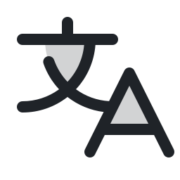
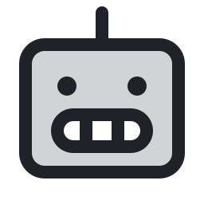
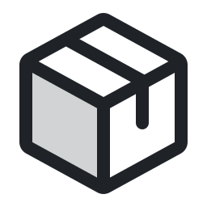

# Efraín Leyva

<picture><source media="(prefers-color-scheme: dark)" srcset="icons/map-pin-dark.svg"></picture> Tijuana, B.C., México &nbsp;·&nbsp; <picture><source media="(prefers-color-scheme: dark)" srcset="icons/translate-dark.svg"></picture> Español nativo · Inglés B1+

---

Construyo software en producción para **manufactura, logística y comercio exterior**: integraciones con ERPs, sistemas de RH con machine learning, migraciones de sistemas legados sin detener la operación y plataformas SaaS en tiempo real.

## <picture><source media="(prefers-color-scheme: dark)" srcset="icons/rocket-launch-dark.svg"></picture> Lo que he construido

| Proyecto | Resultado |
|---|---|
| <picture><source media="(prefers-color-scheme: dark)" srcset="icons/plugs-connected-dark.svg"></picture>&nbsp;**Integración bidireccional con ERP** (Ecount Open API) | Catálogo sincronizado cada noche y movimientos de almacén en tiempo real, con colas, idempotencia y reintentos |
| <picture><source media="(prefers-color-scheme: dark)" srcset="icons/globe-dark.svg"></picture>&nbsp;**Migración a SPA de un ERP legado** de 1,260 rutas (Strangler Fig) | **−52 %** JavaScript · **−33 %** arranque · **−90 %** carga del menú |
| <picture><source media="(prefers-color-scheme: dark)" srcset="icons/robot-dark.svg"></picture>&nbsp;**Sistema de RH con machine learning** (Laravel 12, React 19, Rubix ML) | 200 colaboradores en 9 plantas · **75 %** de casos resueltos automáticamente |
| <picture><source media="(prefers-color-scheme: dark)" srcset="icons/scales-dark.svg"></picture>&nbsp;**Conciliación de Anexo 24** (SAT) y módulo de pedimentos | Cotejo automático partida por partida contra pedimentos aduanales |
| <picture><source media="(prefers-color-scheme: dark)" srcset="icons/package-dark.svg"></picture>&nbsp;**Plataforma SaaS multiempresa** (Django 5, Channels, Celery, React + TS) | Tiempo real con WebSockets · **280** pruebas automatizadas · CI |

## <picture><source media="(prefers-color-scheme: dark)" srcset="icons/briefcase-dark.svg"></picture> Experiencia

**Desarrollador de Software Full-Stack** · Grupo industrial de manufactura y comercio exterior &nbsp;`sep 2025 – hoy` 
Integración con ERP · Migración de sistema legado · Sistema de RH con ML · Cumplimiento aduanero · 70 suites de PHPUnit · Jira + Bitbucket en equipo de 5–10

**Arquitecto y Desarrollador Full-Stack** · Proyecto independiente &nbsp;`2026 – hoy` 
Plataforma SaaS multiempresa: Django 5, DRF, Channels, Celery, PostgreSQL, Redis, React + TypeScript, GitHub Actions

**Desarrollador Web y Soporte de TI** · AlphaCom &nbsp;`ago 2024 – may 2025` 
Plataforma web interna con Node.js, Express y MongoDB en Microsoft Azure

## <picture><source media="(prefers-color-scheme: dark)" srcset="icons/graduation-cap-dark.svg"></picture> Formación

**Ingeniería en Desarrollo y Gestión de Software** · Universidad Tecnológica de Tijuana &nbsp;`2025 – 2026` 
**TSU en Desarrollo de Software Multiplataforma** · Universidad Tecnológica de Tijuana &nbsp;`2022 – 2024`

## <picture><source media="(prefers-color-scheme: dark)" srcset="icons/wrench-dark.svg"></picture> Stack

**Backend** 

**Frontend** 

**Datos y DevOps** 

## <picture><source media="(prefers-color-scheme: dark)" srcset="icons/chart-line-up-dark.svg"></picture> Actividad

## <picture><source media="(prefers-color-scheme: dark)" srcset="icons/lock-key-dark.svg"></picture> Sobre mis repositorios

Mi trabajo profesional vive en repositorios privados. Si quieres conocerlo, **escríbeme y con gusto te muestro una demo**.
